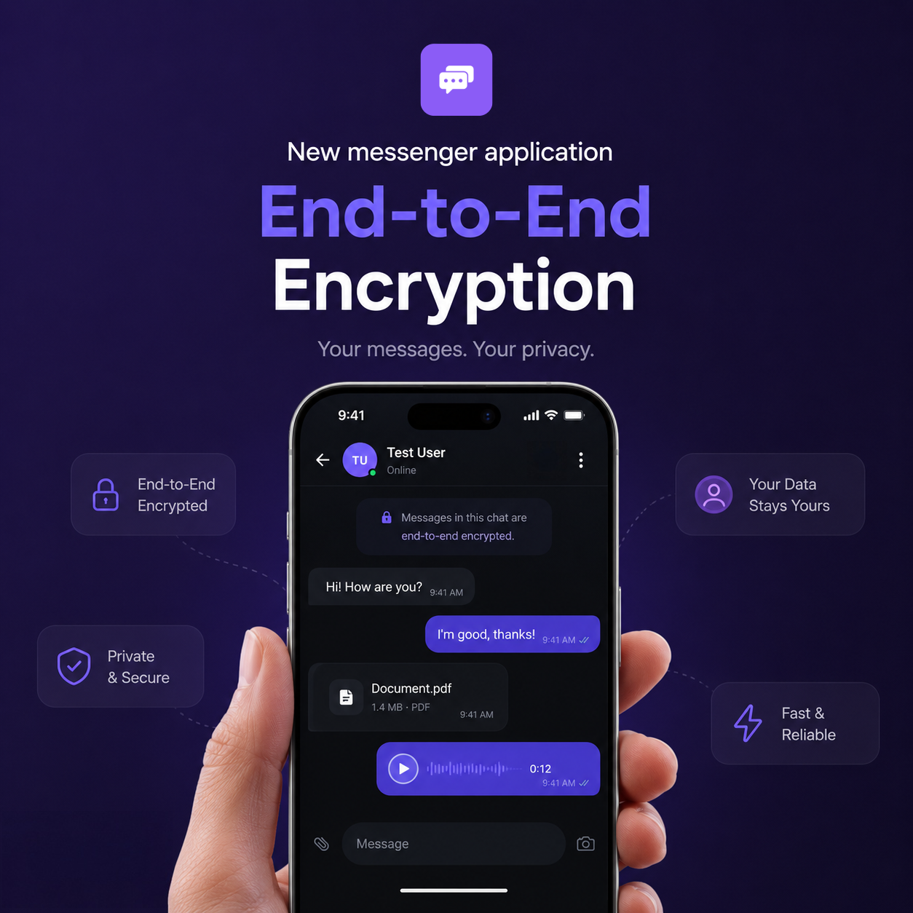
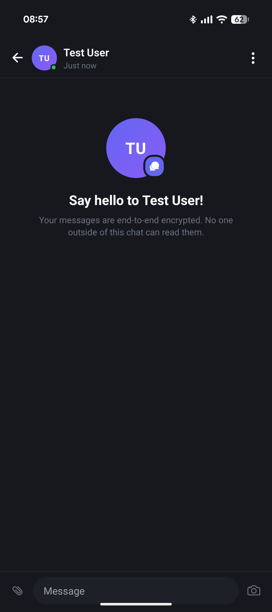
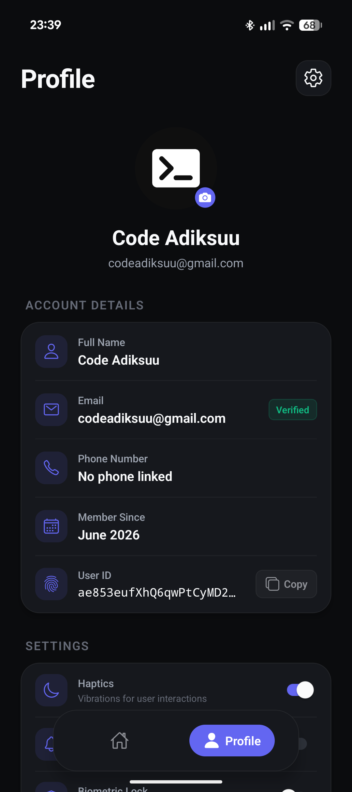
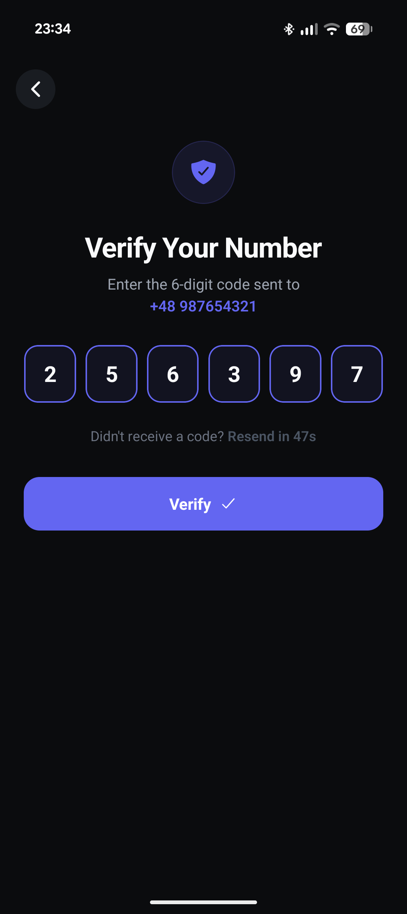

# JustTalk

A real-time mobile messaging application built with React Native and Expo, targeting Android and iOS (iOS maybe later :p). JustTalk provides end-to-end encrypted conversations, multi-provider authentication, media sharing via Cloudinary, and a suite of interactive chat features -- all backed by Firebase Realtime Database for low-latency data synchronization.

**Current version:** 1.0.17 
**Package identifier:** `pl.adiksuu.justtalk`  
**License:** MIT



---

## Table of Contents

1. [Overview](#overview)
2. [Technology Stack](#technology-stack)
3. [Architecture](#architecture)
4. [Features](#features)
5. [Project Structure](#project-structure)
6. [Authentication](#authentication)
7. [Real-Time Systems](#real-time-systems)
8. [Encryption](#encryption)
9. [Media Pipeline](#media-pipeline)
10. [Notifications](#notifications)
11. [User Interface](#user-interface)
12. [Build and Deployment](#build-and-deployment)
13. [Getting Started](#getting-started)
14. [Scripts](#scripts)

---

## Overview

JustTalk is a privacy-focused chat application designed for direct, one-to-one messaging. Every text message, image URL, and video URL stored in the database is encrypted with AES-256 using a per-conversation key derived from the chat identifier. The application leverages Firebase Realtime Database listeners to deliver messages, typing indicators, presence updates, and read receipts with minimal latency.

The project is structured as a single Expo Router application with file-based routing, TypeScript for static type safety, and a clean separation between business logic, UI components, and data interfaces.

---

## Technology Stack

| Layer | Technology | Purpose |
|---|---|---|
| **Framework** | React Native 0.85.3, Expo SDK 56 | Cross-platform mobile runtime |
| **Language** | TypeScript 6.0.3 (strict mode) | Static type checking across the codebase |
| **Routing** | Expo Router 6 | File-based navigation with typed routes |
| **Database** | Firebase Realtime Database | Persistent storage and real-time data sync |
| **Authentication** | Firebase Auth | Multi-provider identity management |
| **Media Storage** | Cloudinary | Image and video upload, transformation, and delivery |
| **Encryption** | CryptoJS (AES) | Client-side message encryption and decryption |
| **State** | React built-in (useState, useMemo, useRef) | Local component state management |
| **Animations** | React Native Animated API, React Native Reanimated 4.3 | Transition and gesture-driven animations |
| **Gestures** | React Native Gesture Handler 2.31 | Swipe-to-reply, double-tap reactions, long-press menus |
| **List Rendering** | Shopify FlashList 2.0.2 | High-performance virtualized message lists |
| **Keyboard** | React Native Keyboard Controller 1.21 | Keyboard-aware input positioning |
| **Haptics** | Expo Haptics | Tactile feedback for interactions |
| **Notifications** | Expo Notifications | Push notification delivery via Expo push service |
| **Biometrics** | Expo Local Authentication | Fingerprint and face authentication |
| **Image Viewing** | react-native-image-viewing | Full-screen image gallery |
| **Video Playback** | expo-video 3.0 | In-chat and full-screen video playback |
| **Screen Capture** | Expo Screen Capture | Screenshot detection and notification |
| **Compilation** | React Compiler (experimental) | Automatic memoization at build time |

---

## Architecture

The application follows a feature-oriented architecture with clear boundaries between layers:

```
src/
  app/          Screen-level components (Expo Router file-based routes)
  components/   Reusable UI components, organized by domain
  functions/    Business logic and Firebase operations (pure functions)
  hooks/        Custom React hooks (theming, color scheme)
  interfaces/   TypeScript type definitions
  constants/    Static data (country codes)
```

**Data flow:** Screens subscribe to Firebase Realtime Database paths through listener functions defined in `src/functions/`. These listeners use `onValue` to push updates reactively into component state. Outgoing operations (sending messages, managing friends) are handled through imperative async functions in the same module.

**Navigation model:** The app uses Expo Router's Stack navigator with three primary routes (`/`, `/login`, `/profile`) and two dynamic route groups (`/auth/*` for authentication flows, `/chat/[id]` for conversations). Auth state is observed at the root level and drives automatic redirection between authenticated and unauthenticated screens.

---

## Features

### Messaging
- Real-time message delivery using Firebase Realtime Database listeners
- AES-256 encryption applied to all message text and media URLs before storage
- Support for five message types: text, image, video, system, and typing indicator
- Rich URL link previews with metadata extraction via `link-preview-js`
- Message pagination with progressive loading (10 messages per batch)
- Inverted FlashList rendering for chat-standard bottom-to-top message ordering
- Message deletion (soft delete with `isRemoved` flag)
- Swipe-to-reply with visual reply preview in the input bar
- Message reply threading with inline preview in the conversation
- Message projects stored in the device's memory
- Message searching feature with results dropdown
- Pinning and unpinning messages with system notifications 
- 

### Reactions
- Double-tap gesture to toggle a heart reaction
- Long-press gesture to open a full reaction menu with five options
- Per-user reaction tracking stored at the message level in Firebase
- Reaction toggle behavior (re-selecting the same reaction removes it)

### Presence and Activity
- Online/offline presence tracking using Firebase `onDisconnect` handlers
- Last-seen timestamps updated automatically on disconnect
- Real-time typing indicators per conversation
- Typing state automatically cleared on navigation away from a chat

### Read Receipts
- Read timestamps recorded per user per conversation
- Real-time subscription to the friend's read timestamp
- Messages visually marked as read when their timestamp precedes the friend's last-read time
- Unread message count computed and displayed on the chat list

### Friend Management
- User search by display name with debounced query execution
- Friend request lifecycle: send, cancel, accept, decline
- Separate filtered views for Friends, Incoming requests, and Outgoing requests
- Friend removal with optional biometric confirmation
- Custom nickname assignment per friend, per conversation
- Empty state handling when the friend list is empty
- Change chat accent theme, per conversation

### Media
- Image and video selection from the device gallery via Expo Image Picker
- Upload to Cloudinary with automatic resource type detection
- Encrypted media URLs stored alongside messages
- Shared media gallery in the chat info subscreen
- Full-screen image viewer with swipe navigation
- Full-screen video player with native playback controls
- Cloudinary-based video thumbnail generation (`.mp4` to `.jpg` extension swap)

### Profile
- User profile display with avatar, name, email, phone number, and join date
- Avatar upload via Cloudinary with real-time database update
- Initials-based fallback avatar rendering
- User ID copy-to-clipboard with animated toast confirmation
- Application version display from Expo config
- 

### Settings
- Haptic feedback toggle (light and heavy impact styles)
- Push notification permission toggle
- Biometric authentication toggle
- Preferences persisted locally via AsyncStorage

### Security
- Screenshot detection within active chat screens
- Automated system message notifying the conversation when a screenshot is taken
- Biometric authentication gate for sensitive actions (friend removal)
- Client-side AES encryption for all stored message content

### Connectivity
- Network connectivity monitoring with periodic health checks
- Dedicated offline state UI when the connection is lost

---

## Project Structure

```
justtalk/
  app.json                  Expo application configuration
  eas.json                  EAS Build profiles (development, preview, production)
  package.json              Dependencies and scripts
  tsconfig.json             TypeScript configuration with path aliases
  google-services.json      Firebase Android configuration
  assets/
    images/                 App icons, splash screen, and static assets
  src/
    app/
      _layout.tsx           Root layout (SafeAreaProvider, KeyboardProvider, StatusBar)
      index.tsx             Home screen (chat list, filters, tab bar)
      login.tsx             Login screen (phone and email entry points)
      profile.tsx           Profile screen (user info, settings, logout)
      auth/
        email.tsx           Email sign-in and sign-up form
        phone.tsx           Phone number verification with OTP input
      chat/
        [id].tsx            Chat conversation screen (messages, input, info subscreen)
    components/
      auth/
        email/              Email authentication form components
        phone/              Phone authentication form components
      chat/
        Avatar.tsx          Initials-based avatar with Firebase-backed image
        ChatEmptyState.tsx  Empty conversation placeholder
        ChatHeader.tsx      Chat screen header with back navigation and info trigger
        ChatInfoSubscreen.tsx  Modal with friend profile, media gallery, and actions
        InputBar.tsx        Message input with attachment, camera, and reply support
        MessageBubble.tsx   Message renderer with gesture detection and decryption
        MessagePreview.tsx  Inline reply preview
        ReactionMenu.tsx    Long-press reaction picker with delete option
        ReadReceipt.tsx     Read status indicator
        RenderReactions.tsx Reaction badge renderer
        ReplyBox.tsx        Reply context bar above the input
        ScrollToBottom.tsx  Floating scroll-to-bottom button
        details/
          ChatThemes.tsx    Chat theme selector
          Header.tsx        Info subscreen header
          Informations.tsx  Friend account details
          Medias.tsx        Shared media grid
          ProfileInfo.tsx   Friend avatar, name (editable), and status
          RemoveFriendModal.tsx  Animated confirmation modal for friend removal
          SearchResultsModal.tsx  Search results dropdown
          SearchMessages.tsx Message searching with results dropdown
          VideoPlayer.tsx   Full-screen video player modal
        messageTypes/
          ImageMessage.tsx  Image message renderer with full-screen preview
          LinkPreviewMessage.tsx  URL preview with metadata extraction
          SystemMessage.tsx Centered system notification message
          TextMessage.tsx   Standard text message bubble
          TypingMessage.tsx Animated typing indicator
          VideoMessage.tsx  Inline video player with playback controls
      profile/
        Avatar.tsx          Profile avatar with upload capability
        BottomSheetModal.tsx Animated bottom sheet for logout confirmation
        FloatingToast.tsx   Animated toast notification
        Header.tsx          Profile screen header
        cards/
          card_1.tsx        Account information card
          card_2.tsx        Preferences card (haptics, notifications, biometrics)
          Logout.tsx        Logout action card
      ui/
        ChatList.tsx        Friends list with real-time chat state listeners
        Filters.tsx         Filter chips (Friends, Incoming, Outgoing)
        Header.tsx          Home screen header with animated search
        NoConnection.tsx    Offline state display
        friends/
          NoFriends.tsx     Empty friends list state
          ResultsDropdownList.tsx  Search results dropdown
          SearchFriend.tsx  Animated search input
          SearchResult.tsx  Individual search result with add/cancel actions
      utils/
        ChatItem.tsx        Chat list item row
        ImagePreview.tsx    Full-screen image viewer wrapper
        TabBar.tsx          Bottom navigation with capsule, classic, and floating styles
    functions/
      activity.ts          Presence, typing status, and read receipt operations
      auth.ts              Authentication flows (phone, email, Google, Facebook (disabled for now), GitHub, biometric)
      crypto.ts            AES encryption and decryption functions
      friends.ts           Friend request lifecycle and user search
      media.ts             Image/video picking, Cloudinary upload, and media gallery
      messages.ts          Message CRUD, real-time subscriptions, and reactions
      notifications.ts     Push notification registration and delivery
      preferences.ts       Local preference management with haptic feedback
      profile.ts           User profile fetching and formatting
      utility.ts           Shared utility functions
    hooks/
      use-color-scheme.ts  Platform-specific color scheme detection
      use-theme.ts         Theme hook
    interfaces/
      Message.ts           Message and MessageType type definitions
      SharedMediaItem.ts   Shared media item type definition
      UserProfileData.ts   User profile type definition
    constants/
      COUNTRIES.ts         Country code data for phone authentication
      THEMES.ts            Chat themes data (accent colors)
    global.css             CSS custom properties for web typography
```

---

## Authentication

JustTalk supports four authentication providers, all managed through Firebase Auth:

| Provider | Flow |
|---|---|
| **Email/Password** | Standard sign-up with email verification, sign-in with error handling |
| **Phone Number** | SMS-based OTP verification with 6-digit code input and 60-second cooldown |
| **Google** | OAuth via `@react-native-google-signin/google-signin` with offline access |
| **Facebook** | OAuth via `react-native-fbsdk-next` with public_profile and email permissions | (disabled for now)
| **GitHub** | OAuth via `expo-auth-session` with `user`, `read:user`, `user:email` scopes

After successful authentication, the user's profile data (UID, display name, email, phone number, creation timestamp) is written to the Firebase Realtime Database under `users/{uid}`. The root layout observes `onAuthStateChanged` and redirects to the login screen when no authenticated session exists.
- 


---

## Real-Time Systems

The application maintains several concurrent real-time subscriptions through Firebase Realtime Database `onValue` listeners:

| System | Database Path | Purpose |
|---|---|---|
| **Messages** | `chats/{chatId}/messages/` | Real-time message delivery with pagination |
| **Typing** | `typing/{chatId}/{uid}` | Per-user typing indicator with `onDisconnect` cleanup |
| **Presence** | `presence/{uid}` | Online/offline state with automatic disconnect handling |
| **Read Receipts** | `chats/{chatId}/read/{uid}` | Per-user last-read timestamp |
| **Friend Requests** | `friends_requests/{uid}/incoming/` and `outgoing/` | Request state changes |
| **Friends List** | `friends/{uid}/` | Friend additions and removals |
| **Custom Usernames** | `chats/{chatId}/usernames/{uid}/chatUsername` | Per-friend nickname changes |
| **Chat Themes** | `chats/{chatId}/theme` | Per-chat accent theme changes |

All listeners are properly cleaned up in `useEffect` return functions to prevent memory leaks.

---

## Encryption

All message content is encrypted client-side before being written to Firebase:

- **Algorithm:** AES-256 via CryptoJS
- **Key derivation:** The chat ID (`{uid1}_{uid2}`, lexicographically ordered) serves as the symmetric key
- **Scope:** Both message text and media URLs are encrypted independently
- **Decryption:** Performed at render time within the `MessageBubble` component using `useMemo` for performance

The encryption covers all message types including text, image URLs, video URLs, and reply references. System messages (screenshot notifications) are also encrypted.

---

## Media Pipeline

```
User selects media (Expo Image Picker)
    |
    v
Resource type detected (image/video)
    |
    v
Uploaded to Cloudinary via multipart form POST
    |
    v
Secure URL returned
    |
    v
URL encrypted with AES (chat ID as key)
    |
    v
Stored in Firebase Realtime Database as message
    |
    v
Decrypted at render time for display
```

- **Image quality:** 0.8 compression
- **Video quality:** UIImagePickerControllerQualityType.Medium
- **Upload preset:** `justtalk_app` (unsigned, Cloudinary-managed)
- **Thumbnails:** Video thumbnails generated by replacing the file extension with `.jpg` in the Cloudinary URL

---

## Notifications

Push notifications are delivered through the Expo push notification service:

1. On app launch, the device's Expo push token is registered and stored in Firebase under `users/{uid}/pushToken`
2. When a message is sent, the sender fetches the recipient's push token from the database
3. A POST request is made to `https://exp.host/--/api/v2/push/send` with the message content
4. Notifications display the sender's name as the title and the message text as the body

---

## User Interface

The interface uses a dark color scheme (`#0B0C0E` background) with an indigo accent (`#6366F1`) and follows these design principles:

- **Navigation:** Floating capsule-style bottom tab bar with animated active state
- **Chat list:** Friends sorted by most recent message, with unread count badges and last message previews
- **Conversations:** Inverted list with bottom-to-top rendering, keyboard-aware input bar, and swipe gestures
- **Animations:** Animated transitions on the login screen (pulsing brand text), profile screen (fade-in with slide), search bar (expand/collapse), toast notifications, and bottom sheet modals
- **Safe areas:** Consistent safe area handling across all screens using `react-native-safe-area-context`
- **Haptic feedback:** Configurable tactile feedback on message send, reactions, and preference changes

---

## Build and Deployment

The project uses Expo Application Services (EAS) for builds:

| Profile | Distribution | Format | Purpose |
|---|---|---|---|
| **development** | Internal | Development client | Local development with hot reload |
| **preview** | Internal | APK | Internal testing and distribution |
| **production** | Default | AAB | Store submission |

The React Compiler experimental flag is enabled in `app.json` for automatic component memoization.

---

## Getting Started

### Prerequisites

- Node.js (LTS)
- Expo CLI
- Android Studio or a physical Android device
- Firebase project with Realtime Database and Authentication enabled
- Cloudinary account with an unsigned upload preset

### Installation

```bash
git clone https://github.com/Adiksuu/justtalk.git
cd justtalk
npm install
```

### Development

```bash
npx expo start
```

For Android native builds:

```bash
npx expo run:android
```

---

## Scripts

| Script | Command | Description |
|---|---|---|
| `start` | `expo start` | Start the Expo development server |
| `android` | `expo run:android` | Build and run on Android |
| `ios` | `expo run:ios` | Build and run on iOS |
| `web` | `expo start --web` | Start the web development server |
| `lint` | `expo lint` | Run the linter |
| `reset-project` | `node ./scripts/reset-project.js` | Reset the project to a clean state |

---

Built by [Adiksuu](https://github.com/Adiksuu)
